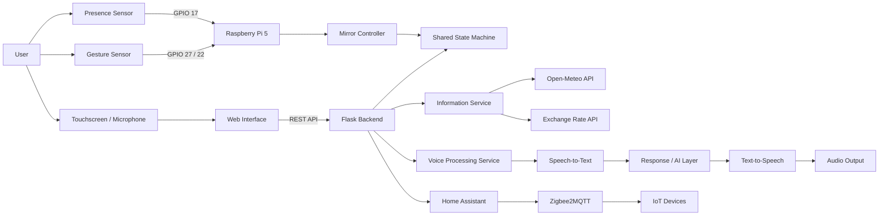

[README_Dianuby_Mirror_AI.md](https://github.com/user-attachments/files/30718625/README_Dianuby_Mirror_AI.md)
# Dianuby Mirror AI

> An interactive smart mirror that combines **embedded electronics, IoT, home automation, voice interaction, and an AI-ready software architecture** on a Raspberry Pi.

<p align="center">
  
  
  
  
  
  
</p>

## Overview

**Dianuby Mirror AI** is a functional smart-mirror prototype designed as an end-to-end electronic engineering project.

The system integrates a Raspberry Pi, presence and gesture sensors, a touchscreen, voice input/output, live information services, and a Home Assistant dashboard. Its interface automatically reacts to the user and switches between three operating modes:

- **INFO** — time, date, weather, temperature, humidity, and exchange-rate information.
- **HOME AUTOMATION** — access to connected devices through Home Assistant and Zigbee.
- **AI** — push-to-talk voice interaction with speech recognition, response processing, and text-to-speech output.

The project demonstrates how software, electronics, APIs, IoT, and human–machine interaction can be integrated into a single physical product.

---

## Demo

> Add a short GIF or video here to make the repository immediately understandable to recruiters.

```html
<p align="center">
  
</p>
```

Suggested demo sequence:

1. User approaches the mirror.
2. Presence sensor activates the interface.
3. Hand gesture changes between INFO, HOME AUTOMATION, and AI modes.
4. User controls a connected device through Home Assistant.
5. User holds the talk button, asks a question, and receives a spoken response.

---

## Key Features

### Presence-aware interface

- Detects when a person approaches the mirror.
- Activates the screen and initializes the INFO mode.
- Returns the interface to standby when presence is no longer detected.
- Keeps the display off when the mirror is not being used.

### Gesture-controlled navigation

The interface changes mode through two digital gesture signals:

| Gesture state | Active mode |
|---|---|
| `00` | INFO |
| `01` | HOME AUTOMATION |
| `11` | AI |
| `10` | Intermediate state — ignored |

The controller includes cooldown and stability filtering to avoid accidental transitions caused by noisy sensor signals.

### Live information dashboard

The INFO mode displays:

- Current time and date
- Weather conditions
- Temperature
- Relative humidity
- USD/ARS exchange-rate data

External API responses are cached to reduce unnecessary requests and preserve the last valid values if a service becomes temporarily unavailable.

### Home automation integration

- Embeds a Home Assistant dashboard directly into the mirror interface.
- Supports Zigbee devices through Zigbee2MQTT.
- Enables monitoring and control of lights, fans, sensors, and other connected devices.
- Keeps the home-automation layer separated from the mirror application.

### Voice interaction

- Push-to-talk interaction from the touchscreen.
- Audio recording through the browser with `MediaRecorder`.
- Audio conversion with FFmpeg.
- Speech-to-text processing in Spanish.
- Text-to-speech output using an Argentine Spanish neural voice.
- Clear interaction states: `LISTENING`, `PROCESSING`, and `RESPONDING`.

### Modular AI-ready response layer

The voice pipeline is intentionally separated from the response engine. The public implementation includes a deterministic command-response module for reliable offline demonstrations, while the same interface can be connected to an external LLM API or a local model without redesigning the complete system.

---

## System Architecture



---

## Operating Modes

| Mode | Purpose | Main integrations |
|---|---|---|
| **INFO** | Shows contextual and real-time information | Open-Meteo, exchange-rate API |
| **HOME AUTOMATION** | Controls and monitors connected devices | Home Assistant, Zigbee2MQTT |
| **AI** | Provides voice-based interaction | Browser audio, SpeechRecognition, FFmpeg, Edge TTS |

---

## Hardware

| Component | Purpose |
|---|---|
| Raspberry Pi 5 — 4 GB | Main processing unit |
| 7-inch HDMI touchscreen | User interface and push-to-talk input |
| 12 V presence sensor | User detection |
| 12 V two-channel gesture sensor | Mode selection |
| Optocoupler interfaces | Electrical isolation and voltage adaptation |
| Sonoff Zigbee Dongle Plus V2 | Zigbee coordinator |
| USB microphone | Voice input |
| MAX98357 I²S amplifier | Digital audio output |
| 4 Ω / 3 W speaker | Voice response |
| 12 V / 16 A power supply | Main power source |
| XL4016 DC-DC converter | 12 V to 5.1 V conversion for Raspberry Pi |

### GPIO Mapping

| Function | Raspberry Pi GPIO |
|---|---|
| Presence sensor | GPIO 17 |
| Gesture signal 1 | GPIO 27 |
| Gesture signal 2 | GPIO 22 |

> The 12 V sensor outputs must not be connected directly to Raspberry Pi GPIO pins. The prototype uses isolated signal-conditioning stages.

---

## Software Stack

### Backend

- Python
- Flask
- gpiozero
- Requests
- SpeechRecognition
- Edge TTS
- FFmpeg / FFplay

### Frontend

- HTML
- CSS
- JavaScript
- Fetch API
- MediaRecorder API
- Touch and pointer events

### IoT and infrastructure

- Home Assistant
- Zigbee2MQTT
- MQTT
- Docker
- Raspberry Pi OS

### External services

- Open-Meteo
- DolarAPI
- Google speech-recognition service
- Microsoft Edge neural text-to-speech

---

## Project Structure

```text
EspejoIA/
├── app.py                  # Flask application and REST endpoints
├── state.py                # Centralized mirror state
├── mirror_controller.py    # Presence, gesture, and mode logic
├── gpio_controller.py      # Raspberry Pi GPIO integration
├── info_service.py         # Weather and exchange-rate services
├── ia_audio_service.py     # Browser audio processing pipeline
├── ia_controller.py        # Voice interaction lifecycle
├── ia_simulada.py          # Replaceable response engine
├── voice_listener.py       # Microphone input and calibration
├── voz_salida.py           # Edge TTS and audio playback
├── templates/
│   └── index.html          # Touch interface and client-side logic
├── static/
│   └── style.css           # Interface styles
└── README.md
```

---

## REST API

| Method | Endpoint | Description |
|---|---|---|
| `GET` | `/` | Loads the mirror interface |
| `GET` | `/api/status` | Returns presence, screen, status, and active mode |
| `GET` | `/api/info` | Returns weather, temperature, humidity, and exchange-rate data |
| `POST` | `/api/next_modo` | Switches to the next operating mode |
| `POST` | `/api/set_modo` | Selects a specific mode |
| `POST` | `/api/set_presence` | Updates presence state for testing or integration |
| `POST` | `/api/screen_off` | Sends the interface to standby |
| `POST` | `/api/ia/process_audio` | Processes a recorded voice request |

---

## Installation

### 1. System requirements

Recommended environment:

- Raspberry Pi 5
- Raspberry Pi OS 64-bit
- Python 3.11+
- Home Assistant available locally
- FFmpeg installed

Install system dependencies:

```bash
sudo apt update
sudo apt install -y python3-venv ffmpeg
```

### 2. Clone the repository

```bash
git clone https://github.com/caraqueleonardoAlfredo/EspejoIA.git
cd EspejoIA
```

### 3. Create a virtual environment

```bash
python3 -m venv .venv
source .venv/bin/activate
```

### 4. Install Python dependencies

```bash
pip install flask requests gpiozero SpeechRecognition edge-tts
```

Depending on the selected microphone workflow, PyAudio may also be required:

```bash
sudo apt install -y portaudio19-dev
pip install pyaudio
```

### 5. Configure Home Assistant

Update the Home Assistant URL in `app.py`:

```python
HOME_ASSISTANT_URL = "http://127.0.0.1:8123"
```

Use the correct local address if Home Assistant runs on another host.

### 6. Configure location

Update the coordinates in `info_service.py`:

```python
LAT = -26.8241
LON = -65.2226
```

### 7. Run the application

```bash
python app.py
```

Open:

```text
http://<RASPBERRY_PI_IP>:5000
```

---

## Kiosk Mode

The interface can be launched automatically in Chromium kiosk mode:

```bash
chromium-browser \
  --kiosk \
  --noerrdialogs \
  --disable-infobars \
  http://127.0.0.1:5000
```

For a production installation, both the Flask application and Chromium can be configured as `systemd` services.

---

## Engineering Highlights

This project is more than a graphical dashboard. It includes several engineering decisions required by a physical, continuously running system:

- Centralized state management for mode, presence, and display status.
- Separation between GPIO access, business logic, APIs, and presentation.
- Debouncing and stability checks for real sensor inputs.
- Graceful fallback when external information services fail.
- Cached API responses to reduce latency and external dependencies.
- Threaded hardware monitoring without blocking the web server.
- Push-to-talk interaction to reduce false voice activations.
- Replaceable AI/response layer.
- Electrical isolation between 12 V sensors and 3.3 V GPIO inputs.
- Integration of embedded hardware with web and IoT technologies.

---

## Current Limitations

- Hardware-specific GPIO code requires a Raspberry Pi or a simulated interface.
- The public response module is deterministic and intended for a stable demonstration; a production LLM integration should add authentication, timeout handling, cost controls, and conversational memory.
- Home Assistant authentication and network configuration depend on the local installation.
- API location coordinates are currently configured in source code.
- Automated tests and continuous integration are not yet included.

---

## Roadmap

- [ ] Add an interchangeable LLM provider interface.
- [ ] Add local-model support for offline operation.
- [ ] Persist conversation history and system events.
- [ ] Move configuration to environment variables.
- [ ] Add unit and integration tests.
- [ ] Add structured logging and health checks.
- [ ] Package the application with Docker Compose.
- [ ] Add secure Home Assistant authentication.
- [ ] Add a configurable admin dashboard.
- [ ] Add a public demonstration video and architecture images.

---

## Why This Project Matters

Dianuby Mirror AI demonstrates the ability to design and implement a complete cyber-physical system:

- Electronic design and signal integration
- Embedded Linux and GPIO
- Backend and frontend development
- API integration
- Voice interfaces
- IoT and home automation
- System architecture
- Product-oriented engineering

It was developed as the final project for an Electronic Engineering degree and as a practical exploration of intelligent interfaces that connect software with the physical world.

---

## Author

**Leonardo Alfredo Caraque**  
Electronic Engineer · AI Engineer · Software Developer

- LinkedIn: [caraque-leonardo](https://www.linkedin.com/in/caraque-leonardo/)
- GitHub: [caraqueleonardoAlfredo](https://github.com/caraqueleonardoAlfredo)

---

## License

This repository is currently provided for educational and portfolio purposes. Add a formal open-source license before permitting external redistribution or commercial reuse.
